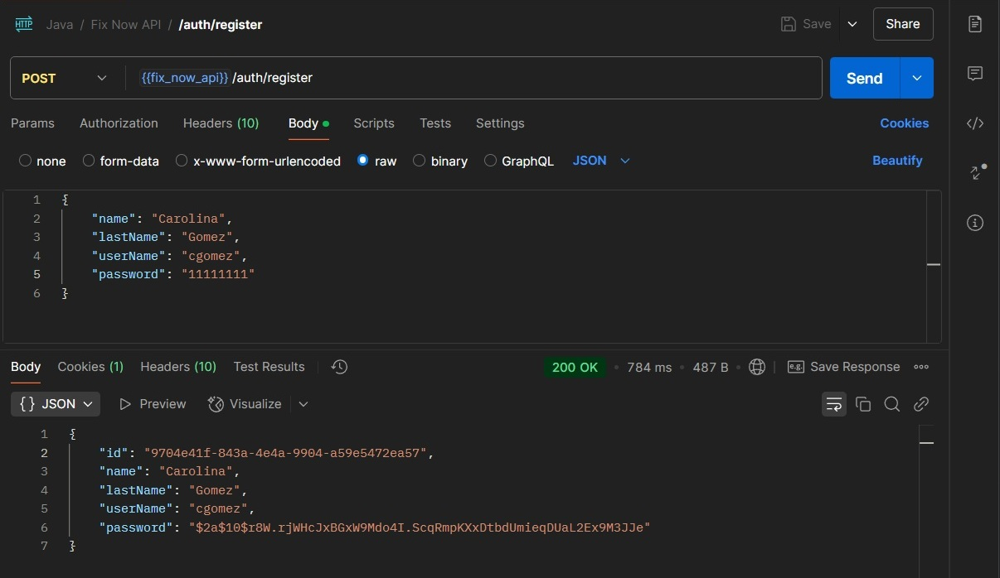
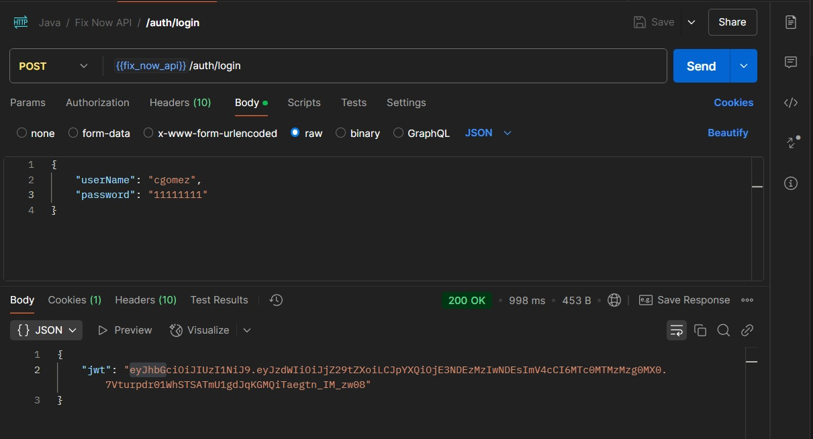
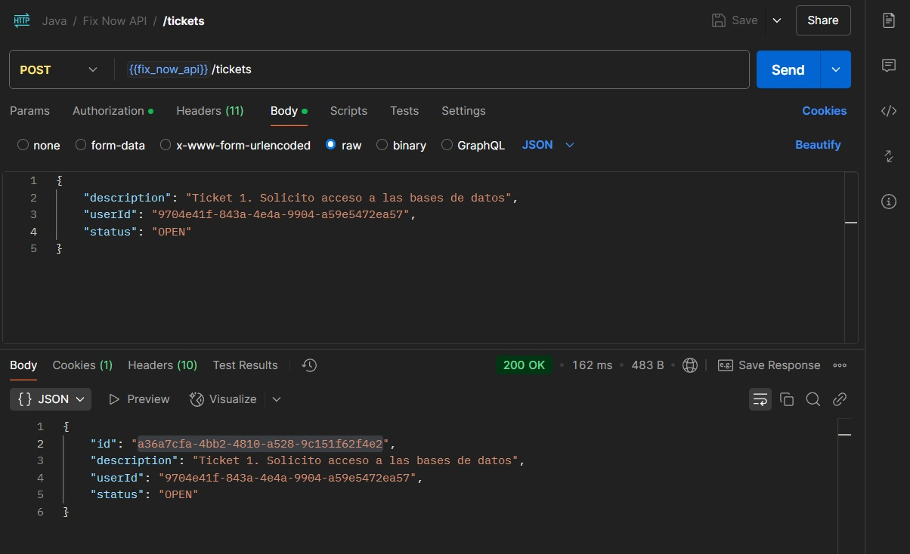
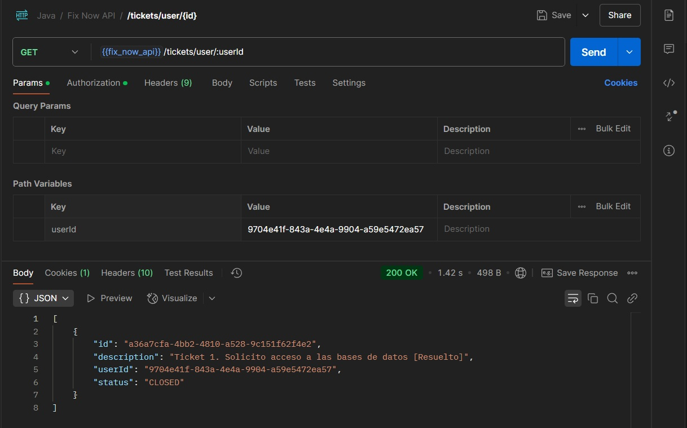
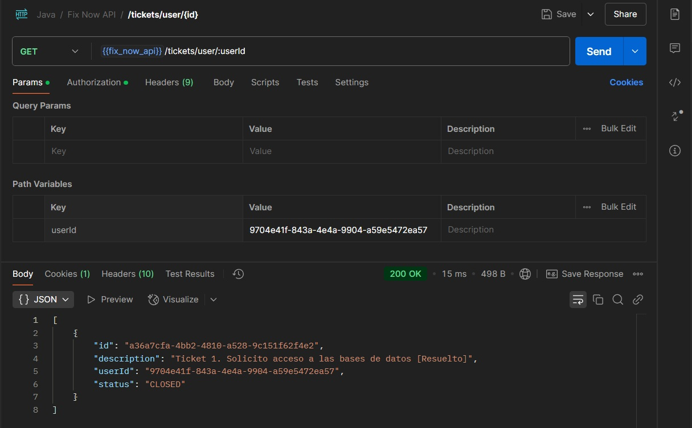
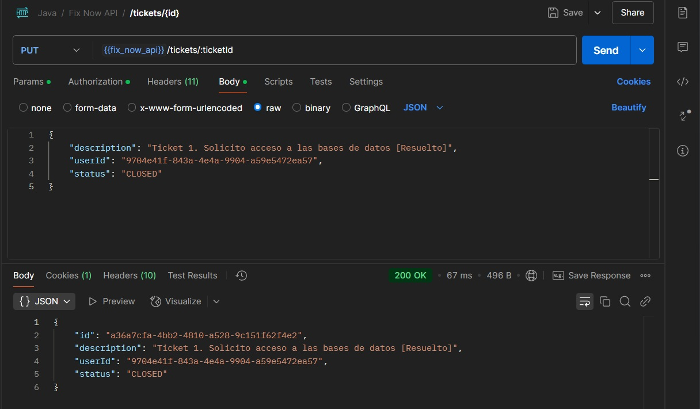
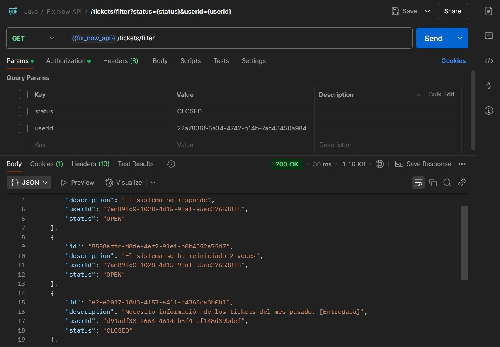

# Fix Now API

Fix Now API is a Spring Boot application designed to manage tickets and user authentication. It provides endpoints for creating, retrieving, updating, and filtering tickets, as well as user registration and login functionalities.

## Table of Contents

- [Requirements](#requirements)
- [Installation](#installation)
- [Configuration](#configuration)
- [Running the Application](#running-the-application)
- [API Documentation](#api-documentation)
- [Endpoints](#endpoints)
  - [Auth](#auth)
  - [Tickets](#tickets)
- [Error Handling](#error-handling)
- [License](#license)

## Requirements

- Java 17 or higher
- Maven 3.6.3 or higher
- Docker (for Redis)

## Installation

1. Clone the repository:
    ```sh
    git clone https://github.com/juanalsa/fix-now-api.git
    cd fix-now-api
    ```

2. Build the project using Maven:
    ```sh
    mvn clean install
    ```

3. Start Redis using Docker:
    ```sh
    docker run --name redis -p 6379:6379 -d redis
    ```

## Configuration

The application configuration is managed through the `application.yml` file located in `src/main/resources`. Below is a summary of the key configurations:

```yaml
server:
  port: 8080

spring:
  datasource:
    url: jdbc:h2:mem:fixnowdb
    driver-class-name: org.h2.Driver
    username: sa
    password:
  jpa:
    database-platform: org.hibernate.dialect.H2Dialect
    hibernate:
      ddl-auto: update
    show-sql: true
    defer-datasource-initialization: true

  h2:
    console:
      enabled: true
      path: /h2-ui

  cache:
    type: redis
  data:
    redis:
      host: redis
      port: 6379
      password: test
      timeout: 60000 # 60 secs

security:
  jwt:
    secret-key: U2VkZWJlZ2VuZXJhcnVuYXNlbWlsbGFsb3N1ZmljaWVudGVtZW50ZWdyYW5kZXBhcmFwb2RlcnF1ZWN1bXBsYWNvbmxvc3JlcXVpc2l0b3M=
    expiration-in-minutes: 30

springdoc:
  api-docs:
    path: /api-docs
  swagger-ui:
    path: /swagger-ui.html
    operationsSorter: method
    tagsSorter: alpha

logging:
  level:
    org:
      springframework:
        security: DEBUG
```

## Running the Application

To run the application, use the following command:
```sh
mvn spring-boot:run
```

The application will be accessible at `http://localhost:8080`.

## API Documentation

The API documentation is available via Swagger UI at `http://localhost:8080/swagger-ui.html`.

## Endpoints

### Auth

- **POST /auth/register**: Register a new user.
  


- **POST /auth/login**: Authenticate a user.
  
- **POST /auth/logout**: Logout a user.

### Tickets

- **POST /tickets**: Create a new ticket.
  

- **GET /tickets/{id}**: Get a ticket by ID.
- **GET /tickets**: Get all tickets (paginated).
- **GET /tickets/user/{id}**: Get all tickets for a specific user.
  

  

- **PUT /tickets/{id}**: Modify a ticket.
  

- **GET /tickets/filter**: Filter tickets by status and user ID.
  

## Error Handling

The application uses custom exceptions to handle errors, such as `UserNotFoundException`, `TicketNotFoundException`, and `UserAlreadyExistsException`. These exceptions return appropriate HTTP status codes and messages.

## License

This project is licensed under the MIT License. See the [LICENSE](LICENSE) file for details.
```